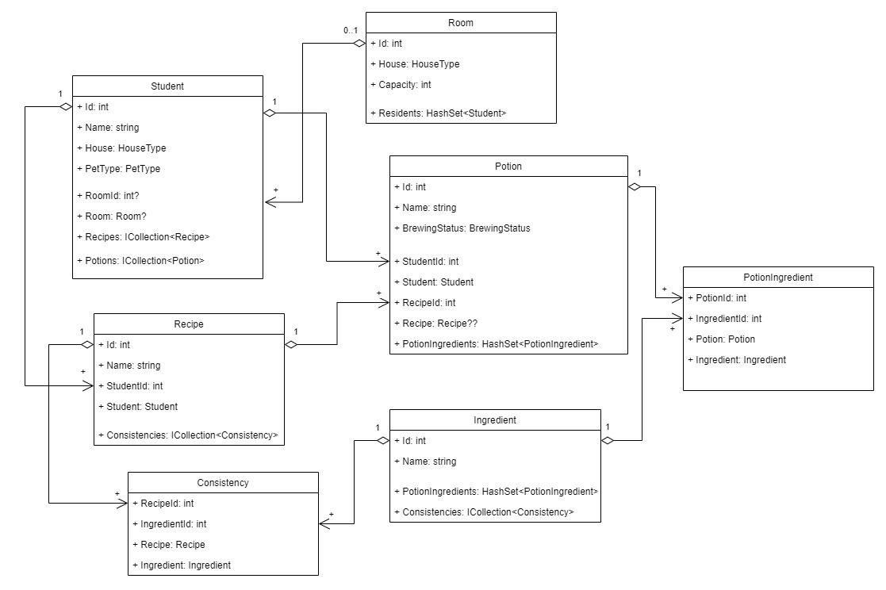

# Hogwarts Potions
## About the project
The main goal for this application is to store different Hogwarts-related entities in a database and to serve different endpoints for reading, creating, updating and deleting these entities. 
The most interesting and complex part of the application is that a user can brew new potions from various ingredients and during this process may also create new recipes. This potion-brewing feature comes with a user interface written in React.js 

## Main features and technologies
- ASP .NET backend with different endpoints, using the Repository pattern and the Unit of Work pattern
- Entity Framework as an ORM tool
- MSSQL database with persistent data and connected tables
- React frontend with routing and clean UI (made with MaterialUI components) for managing and creating potions

### UML diagram of the model classes
